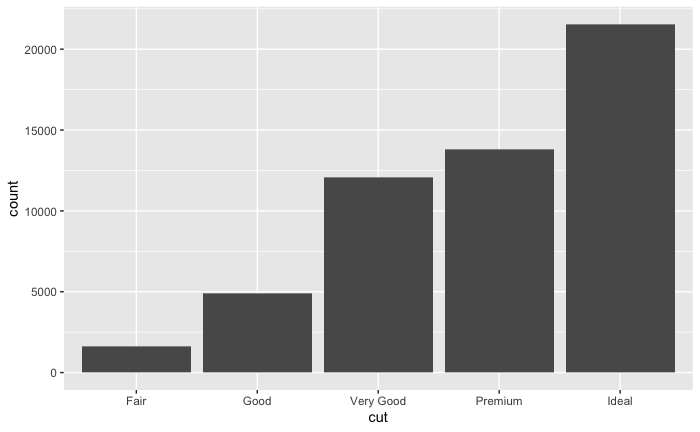
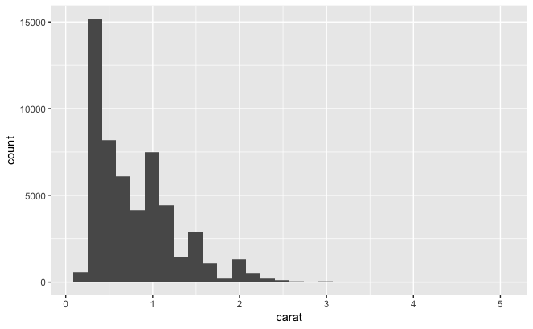

[Foundations of Data Science with Capstone at SMU, Summer 2021]
Day 6: Exploratory Data Analysis (EDA)
========================================================
author: Dr. Jeho Park
date: 07/12/2021
autosize: true


Today's Topic
==========
- Exploratory Data Analysis (EDA) 
- EDA using Distributions of Data: clustering values, finding unusual values, zoom-in, etc,
- How to deal with unusual values
- EDA using Covariation of two variables: histogram/density plot, scatter plot, boxplot, and tile/heat map

EDA (탐색적 데이터 분석 방법) Cycle 
=======


__Your goal during EDA is to develop an understanding of your data__

(1) Generate questions about your data. 

(2) Search for answers by visualizing, transforming, and modelling your data.

(3) Use what you learn to refine your questions and/or generate new questions 


Explore Variation of Data (데이터 변화/변동 분석)
============

- Visualize distribution
- Find out typical values
- Examine unusual values

Distributions of Data (데이터의 분포를 통한 분석)
===============
- Distribution of Discrete Variable



-----

- Distribution of Continuous Variable



Distributions of Data (데이터의 분포를 통한 분석)
===============
- Distribution of Discrete Variable

```r
ggplot(data = diamonds) +
  geom_bar(mapping = aes(x = cut))
```
>> A barplot with one variable counts the number of observations in each group and displays the count as the height of a bar for each group

- Distribution of Continuous Variable

```r
ggplot(data = diamonds) +
  geom_histogram(mapping = aes(x = carat), binwidth = 0.5) # Try different bins or binwidth to see different patterns
```

>> A histogram divides the x-axis into equally spaced bins and then uses the height of a bar to display the number of observations that fall in each bin.

[Hands-On] Zoom-In on X axis
========

From the distribution of carats in `diamonds`, we found that the dataset contains a large number of small diamonds and a small number of large diamonds, making the histogram skewed (치우친, 기운). In real world datasets, having a skewed distribution is not unusual. To look at the details of the large number of data points, we often want to zoom into the majority of data points.

In this hands-on exercise, do the following:  
(1) Filter `diamonds` to create a subset (name it `small_dia`) containing diamonds less than 3 carats.  
(2) Plot a histogram whose bin width is 0.1  


```r
small_dia <-
  diamonds %>% 
    filter(carat < 3)

ggplot(data = small_dia) +
  geom_histogram(mapping = aes(x = carat), binwidth = 0.1)
# fill-in
```

Challenge:  
(3) Find the number of diamonds in each of the bins  
(4) Find how many diamonds are in the tallest bar  


```r
small_dia %>% 
  count(cut_width(carat, 0.1)) %>% 
  arrange(desc(n))
  
# Hint: count() and cut_width()
```

Questions to Ask
======

- Which values are the most common? Why?

- Which values are rare? Why? 

- Does the data distribution match your expectations?

- Can you see any unusual patterns? What might explain them?

Clustering or Pattern
==========
Do you see clusters (군집) in the following histogram?

```r
ggplot(data = small_dia, mapping = aes(x = carat)) +
  geom_histogram(binwidth = 0.01)
```

How about patterns?

```r
diamonds %>% 
  filter(carat >= 1 & carat < 2) %>% 
  ggplot(mapping = aes(x = carat)) +
  geom_histogram(binwidth = 0.01)
```

Unusual Values (Outliers)
=============
Outliers could be errors but, sometimes, they could mean a *very important finding*. So, the outlier analysis is important in data science.

Let's look at the histogram of y (width in mm):


```r
ggplot(diamonds) + 
  geom_histogram(mapping = aes(x = y), binwidth = 0.5) # y: width in mm (0–58.9)
```

Due to the overwhelmingly large number of common width diamonds, it is impossible to see the short bins. We need to zoom into small y values.

Zoom-In on Y axis
========
`coord_cartesian()` can be used to zoom in to y axis as well as x axis:


```r
ggplot(diamonds) + 
  geom_histogram(mapping = aes(x = y), binwidth = 0.5) +
  coord_cartesian(ylim = c(0, 50)) # shows only the count is less than or equal to 50
```

[Hands-On] Find the outliers
==================
From the previous example, we found that there are a small number of diamonds whose width is 0, ~30, and ~60. In this hands-on, we find the outliers and look at the price or other variables to confirm if they might be errors or special diamonds.


```r
# replace proper arguments with <FILL-IN>
diamonds %>% 
  filter(y < 2 | y > 30) %>% # filter diamonds by y values less than 3 or greater than 30 
#  select(price, carat, x, y, z) %>% 
  arrange(y)
```

So, what is your conclusion? Are the outliers good values or bad values?


"To remove, or not to remove, that is the question"
==================
__What happens if we remove those outliers from diamonds dataset?__

==> It will drop entire row and affect statistics of other variables. Its impact would be very high if there are many NA's in one variable.

__To keep all the observations, we just want to replace the questionable or unusual values with NA__

HOW?

Use `base::ifesle()` or `dplyr::replace()`

Replacing unusual values with NA's
==================

`ifelse(<CONDITION>, <IF_TRUE_DO_THIS>, <ELSE_DO_THIS>)`


```r
diamonds2 <-
  diamonds %>% 
    mutate(y = ifelse(y < 2 | y > 30, NA, y)) %>% 
    arrange(y)
```

`replace(<VAR>, <CONDITION>, <IF_TRUE_REPLACE_VAR_With_THIS>)`


```r
diamonds3 <-
  diamonds %>% 
    mutate(y = replace(y, y < 3 | y > 30, NA)) %>% 
    arrange(y)
```

Covariation of two variables
=============
__There are several ways to check the relationship between two variables__

- Scatter plot
- Boxplot
- Overlaid Density Plot

Checking Relationship Depending on the Variable Types
=======================

(1) Categorical vs Continuous  
(2) Categorical vs Categorical  
(3) Continuous vs Continuous

__At this point, let's review our understanding about the following types of variables__

- Categorical
- Discrete
- Continuous

[Hands-On] Identify variable types
===================

Put "C" for categorical, "D" for discrete, and "Cn" for continuous variable: 

- `mpg$drv`
- `mpg$hwy`
- `mpg$model`
- `diamonds$cut`
- `diamonds$carat`
- `diamonds$price`
- `flights$arr_delay`
- `flights$dep_time`


Covariation of Categorical vs Continuous Variable
==================

## Distribution

__Visualize the distribution of a continuous variable for different group of a categorical variable__

Example: Distribution of U.S. Infant Birth Weights (https://letstalkdata.com/2014/06/distribution-of-u-s-infant-birth-weights/)

Important consideration for visualizing different categories in one plot
====================
What is the problem of the following frequency polygon plot?


```r
ggplot(data = diamonds, mapping = aes(x = price)) + 
  geom_freqpoly(mapping = aes(colour = cut), binwidth = 500)
```


```r
ggplot(data = diamonds, mapping = aes(x = price, y = ..density..)) + 
  geom_freqpoly(mapping = aes(colour = cut), binwidth = 500)
```

>> __What is a density curve?__  
>> A density curve is a graph that shows probability. So, the area under the density curve is 1.


```r
ggplot(data = diamonds, mapping = aes(x = price)) + 
  geom_density(mapping = aes(colour = cut))
```

Boxplot Revisited
=============


Example: EDA with Boxplot
===============

```r
ggplot(data = mpg, mapping = aes(x = class, y = hwy)) +
  geom_boxplot()
```


```r
ggplot(data = mpg) +
  geom_boxplot(mapping = aes(x = reorder(class, hwy, FUN = median), y = hwy))
```


[Hands-On] Find unusual values
=====================
Let's look at the Births2015 data and answer the following question: Which day of a week do you think would have the least number of new born babies?

First, import the Births2015.csv.

```r
library(readr)
Births2015 <- read_csv("Births2015.csv", col_types = cols(X1 = col_skip()))
```

And then, plot `births` vs. `date` on a scatter plot

```r
ggplot(data = Births2015) +
  aes(date, births) +
  geom_point(aes(color = wday))
```

Do you see any pattern? Can you identify which day of a week showing low number of births?

```r
# Boxplot showing births on each day of a week
ggplot(data = Births2015) +
  aes(x = wday, y = births) +
  geom_boxplot()
```


Covariation of Categorical vs Categorical Variable
=============
To visualize the covariation between two categorical variables, you’ll need to count the number of observations for each combination. 


```r
ggplot(data = mpg, mapping = aes(x = drv, y = class) ) +
  geom_count()
#  geom_point()
```


```r
ggplot(data = diamonds) +
  geom_count(mapping = aes(x = cut, y = color))
```

You can also use `count()` to count each group and then use `geom_tile()` to fill each combination with different color corresponding to the count, `n`, (like a heat map).  

```r
diamonds %>% 
  count(color, cut) %>%  
  ggplot(mapping = aes(x = color, y = cut)) +
    geom_tile(mapping = aes(fill = n))
```

Covariation of Continuous vs Continuous Variable
===================
A scatter plot is a great way to show a relationship (covariation) between two continuous variables.


```r
ggplot(data = diamonds) +
  geom_point(mapping = aes(x = carat, y = price))
```

It is less effective if there are many overlapping points. In this case, we can use the heat map (tile) approach.

```r
ggplot(data = small_dia) +
  geom_bin2d(mapping = aes(x = carat, y = price))
```

There is another, even more visually attractive, heat map approach for continous variables: Hexagonal bins. 


```r
# install.packages("hexbin")
ggplot(data = small_dia) +
  geom_hex(mapping = aes(x = carat, y = price))
```

[Homework] 
==========
Read 7.6 and 7.7


Lab6
==========
Exercise 7.4.1: #1, #2

Exercise 7.5.1.1: #2, #4, $6

Exercise 7.5.1.2: #1 (Hint: calculate a new variable which is the proportion of each cut within a color)

Exercise 7.5.1.3: #2 (Hint: divide the `price` variable into 10 groups or bins, and then apply geom_boxplot.)
